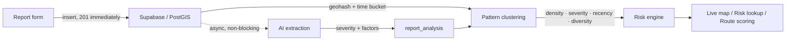
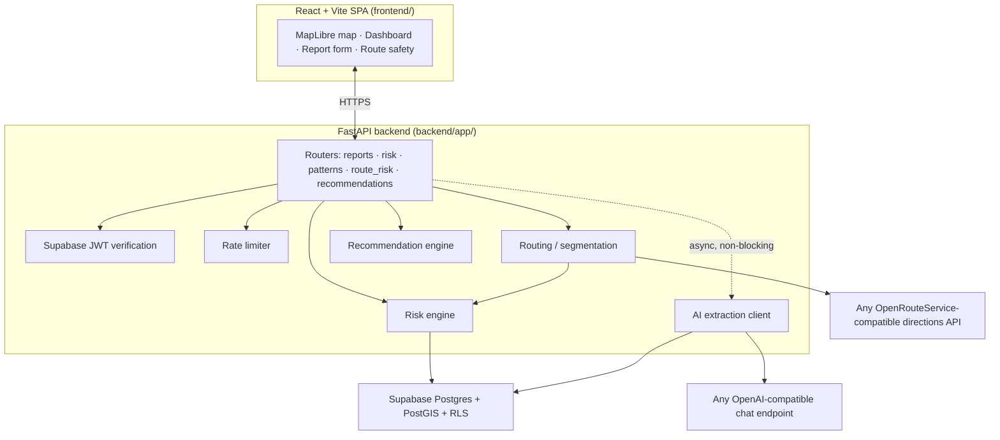

# SheSignal

Crowdsourced street-safety intelligence for anonymous incident reports turned
into a **transparent, tunable risk score**, live pattern clusters on a map,
and a route planner that scores a walk turn-by-turn instead of handing back
one number for an entire city.

The goal isn't a black-box "safety score." It's a system you can actually
audit: every report that comes in, every pattern it forms, every weight in
the risk formula, and every reason a route segment is flagged all
inspectable, all in config, none of it hidden behind a model you can't
question.



---

## Table of contents

- [The problem](#the-problem)
- [How it works](#how-it-works)
  1. [Anonymous reports, immediately saved](#1-anonymous-reports-immediately-saved)
  2. [AI enrichment, never on the critical path](#2-ai-enrichment-never-on-the-critical-path)
  3. [Pattern clustering: geohash + time bucket](#3-pattern-clustering-geohash--time-bucket)
  4. [The risk engine: four explainable signals](#4-the-risk-engine-four-explainable-signals)
  5. [Route safety: segmenting a walk](#5-route-safety-segmenting-a-walk)
  6. [Recommendations](#6-recommendations)
  7. [Auth and Row-Level Security](#7-auth-and-row-level-security)
  8. [Rate limiting](#8-rate-limiting)
  9. [Caching](#9-caching)
- [Project architecture](#project-architecture)
- [Running it locally](#running-it-locally)
- [API surface](#api-surface)
- [Running the tests](#running-the-tests)
- [Limitations](#limitations)
- [Future improvements](#future-improvements)

---

## The problem

Personal-safety apps tend to fail in one of two directions: they dump raw,
unmoderated crime data on you with no context, or they hide behind a vague
"safety score" nobody can inspect. The people who most need street-level,
*recent*, *hyperlocal* signal for women walking alone, late-shift commuters,
students on an unfamiliar campus that are left guessing either way.

SheSignal turns anonymous, community-submitted reports into a score you can
trace back to its inputs, hotspots that only surface once they're an actual
*pattern* (not a one-off), and a route planner that shows you which turn is
the risky one.

---

## How it works

### 1. Anonymous reports, immediately saved

A report (`POST /reports`) is a category, description, coordinates, and an
optional occurred-at time. It's written straight to Supabase and the
endpoint returns **`201` immediately** means nothing downstream (AI enrichment,
clustering) is allowed to block or fail the report itself.

Reporter identity is captured (`reporter_id`) for rate limiting and
ownership checks, but it is **never returned by any endpoint** but not the
public feed, not the analysis endpoints. Fetching a report analysis you
don't own returns `404`, not `403`, so a caller can't even confirm someone
else's report exists.

### 2. AI enrichment, never on the critical path

After the `201` is already committed, the report description is passed to
an LLM behind any OpenAI-compatible `/chat/completions` endpoint (Gemini's
compat layer, Groq, OpenAI, OpenRouter that is swap providers with an env var, no
code change). The model extracts:

- a refined **category**
- a **severity** (low / medium / high)
- **time-of-day context**
- a list of **contributing factors** (poor lighting, stalking, unsafe
  transit, etc.)

The raw response is validated against a Pydantic schema before anything is
trusted. If the AI call fails, times out, or the response fails validation,
the report is marked `failed` in `report_analysis` and nothing else
happens in the report the user submitted is already safe on disk regardless.
Owners can manually retry a failed analysis via
`POST /reports/{id}/reanalyze`, which is blocked with `409` if an analysis
already completed, so it can't silently re-run twice.

### 3. Pattern clustering: geohash + time bucket

Individual reports don't drive the map **BUT** **patterns** do. A Postgres
function, `recompute_patterns()`, buckets reports by:

- **geohash** (precision configurable, default 7 that is roughly a
  150m × 150m cell), and
- **time-of-day bucket** (morning / afternoon / evening / night)

then groups reports that fall in the same cell *and* the same time bucket,
within a configurable lookback window (default 90 days). A cluster only
becomes a visible pattern once it clears a minimum report count (default
3) so a single anonymous report can't spike the map, but a real recurring
pattern will. Each pattern stores a centroid, a report count, a
severity breakdown, and a factor breakdown, ready for the risk engine to
consume directly. Recomputation is throttled server-side (default every 5
minutes) rather than running per-request.

### 4. The risk engine: four explainable signals

No black box means the score for any lat/lng is a weighted blend of four
independently-testable signals (see
[`backend/tests/test_risk_engine.py`](./backend/tests/test_risk_engine.py)):

```
risk = (density × 0.35) + (severity × 0.35) + (recency × 0.20) + (diversity × 0.10)
```

- **Density** — nearby report volume, saturating at a configurable
  threshold (default 20 reports) so one extreme hotspot can't max out the
  scale for the whole map.
- **Severity** — patterns' AI-classified severity breakdown, weighted
  low/medium/high, normalized to 0–100.
- **Recency** — exponential half-life decay (default 30 days) applied to
  the most recent report in range, so last year's cluster fades relative to
  last week's activity.
- **Diversity** — how many *distinct* contributing factors show up nearby;
  three different problems (lighting + stalking + no security) reads as
  riskier than three reports of the exact same thing.

Every weight, saturation point, half-life, and radius lives in
`backend/app/config.py` as an environment-overridable setting and nothing is
hardcoded into the scoring logic. The final score is bucketed into
`low` / `moderate` / `high` against configurable thresholds, and the
response includes the top contributing factors and a human-readable
explanation generated from the same numbers the score was built from  which is not
a separate free-text model call.

### 5. Route safety: segmenting a walk

`POST /route-risk` takes a start and destination, fetches a walking route
from any OpenRouteService-compatible directions API, then:

1. **Segments the polyline** (`routing/segmentation.py`) into a target
   number of roughly-equal-length pieces using cumulative haversine
   distance. not equal *point* counts, since GPS points cluster unevenly
   along a real route.
2. Runs the **same risk engine** from section 4 against each segment's
   midpoint, at a smaller radius tuned for street-level granularity.
3. **Combines segment scores** (`routing/risk.py`) into one overall route
   score as a weighted blend of the *average* segment score and the *worst*
   segment score so a route that's fine except for one bad block still
   reads as risky overall, not diluted away by the safe stretches around it.

The response includes both the overall score and the full per-segment
breakdown, so the frontend can render exactly which stretch of the walk is
driving the number up.

### 6. Recommendations

`GET /recommendations` takes the same nearby-pattern data the risk engine
uses and maps the dominant contributing factors to template-based safety
tips (`recommendations/templates.py`)  context-aware because they're
driven by what's actually been reported nearby, not a generic static list.

### 7. Auth and Row-Level Security

Auth tokens are Supabase-issued JWTs, verified server-side against
Supabase's own JWKS endpoint (`dependencies.py`) the backend never trusts
a token without checking it against Supabase's published signing keys, and
caches the JWKS client rather than re-fetching it per request.

Every table is additionally locked down with Postgres **Row-Level Security**
policies, verified by a dedicated
[`rls_tests.sql`](./backend/supabase_db/rls_tests.sql) suite so even a
bug in the API layer doesn't expose another user's data at the database
level.

### 8. Rate limiting

A small in-memory sliding-window limiter (`rate_limit.py`) gates every
write and every expensive read, with independent, configurable per-minute
limits for reports, AI analysis, risk lookups, route scoring, and the
public feed. Report and AI limits are keyed **per authenticated user**, not
per IP, so switching networks doesn't get around them; the public feed is
keyed per IP to blunt scraping.

### 9. Caching

Risk (`risk/cache.py`) and route-provider (`routing/cache.py`) responses
are cached with a short, configurable TTL, keyed on coordinates rounded to
a configurable precision so nearby, near-simultaneous lookups (e.g. a
route with many overlapping segment queries) don't each trigger a fresh
database scan or a fresh call to the routing provider.

---

## Project architecture



```
SheSignal/
├── backend/
│   ├── app/
│   │   ├── main.py               # FastAPI app entry point
│   │   ├── config.py             # every tunable weight/threshold/limit
│   │   ├── database.py           # Supabase queries
│   │   ├── dependencies.py       # JWT verification against Supabase JWKS
│   │   ├── rate_limit.py         # in-memory sliding-window limiter
│   │   ├── ai/                   # LLM client, schemas, extraction service
│   │   ├── risk/                 # risk engine, service, cache
│   │   ├── patterns/             # geohash/time-bucket clustering trigger
│   │   ├── routing/              # ORS client, segmentation, route risk
│   │   ├── recommendations/      # factor → tip templates
│   │   ├── models/                # Pydantic request/response schemas
│   │   └── routers/              # reports, risk, patterns, route_risk, recommendations, health
│   ├── supabase_db/
│   │   ├── migrations/           # schema, report_analysis, patterns, RLS support
│   │   └── rls_tests.sql          # verifies Row-Level Security policies
│   └── tests/                     # one suite per concern (AI, auth, risk, routing, rate limit...)
└── frontend/
    └── src/
        ├── pages/                # Home, Dashboard, Report, RouteSafety, ZoneDetails, Login/Signup
        ├── components/           # map, route, ui (shadcn/ui + Radix)
        ├── hooks/                # TanStack Query hooks per endpoint
        ├── contexts/             # Auth, Theme
        └── lib/                  # Supabase client, schemas (Zod), risk copy, geocoding
```

Every arrow is a real interface, not just a folder boundary: the risk
engine never talks to Supabase directly (that's `database.py`'s job), the
route service reuses the exact same risk engine the `/risk` endpoint uses
rather than a parallel implementation, and AI enrichment is wired in as a
best-effort side effect of report creation but never a dependency the report
endpoint waits on.

---

## Running it locally

### Prerequisites

- Node 18+ and Python 3.11+
- A free [Supabase](https://supabase.com) project (Postgres + PostGIS + Auth)
- A free API key from any OpenAI-compatible LLM provider (Gemini's
  OpenAI-compat layer works out of the box and is free)
- A free [OpenRouteService](https://openrouteservice.org) API key for route
  safety scoring

### 1. Database

Run the migrations in `backend/supabase_db/migrations/` against your
Supabase project in order (`0001` → `0005`). `rls_tests.sql` verifies your
Row-Level Security policies are locked down correctly before you go further.

### 2. Backend

```bash
cd backend
python -m venv venv && source venv/bin/activate      # venv\Scripts\activate on Windows
pip install -r requirements.txt
cp .env.example .env    # fill in SUPABASE_*, AI_API_KEY, ROUTE_PROVIDER_API_KEY
uvicorn app.main:app --reload
```

API docs are available at `http://localhost:8000/docs`.

### 3. Frontend

```bash
cd frontend
npm install
cp .env.example .env    # fill in VITE_API_BASE_URL + Supabase public keys
npm run dev
```

App runs at `http://localhost:5173`.

---

## API surface

| Method | Endpoint | Auth | Purpose |
|---|---|---|---|
| `POST` | `/reports` | ✅ | Submit an incident report; triggers async AI analysis |
| `GET` | `/reports` | — | Public, paginated, sanitized report feed |
| `GET` | `/reports/{id}/analysis` | ✅ (owner) | AI-extracted severity/factors for your own report |
| `POST` | `/reports/{id}/reanalyze` | ✅ (owner) | Re-run AI extraction on a failed analysis |
| `GET` | `/patterns` | — | Geo-clustered recurring incident patterns |
| `GET` | `/risk` | — | Deterministic risk score for a lat/lng |
| `POST` | `/route-risk` | ✅ | Segment-by-segment risk score for a walking route |
| `GET` | `/recommendations` | — | Context-aware safety tips for a location |
| `GET` | `/health` | — | Liveness check |

Full interactive schema at `/docs` once the backend is running.

---

## Limitations

- **In-memory rate limiting.** Limits reset on restart and aren't shared
  across multiple backend instances — fine for a single deployment, not for
  a horizontally-scaled one.
- **No push notifications.** New patterns near a saved location don't
  proactively alert anyone yet.
- **Single routing provider per deployment.** The route safety feature
  depends on whichever OpenRouteService-compatible provider is configured;
  there's no automatic fallback between providers.
- **English-only AI extraction.** Report descriptions are analyzed in
  whatever language the model receives them in, but prompts/schemas aren't
  currently localized.
- **No offline mode.** The frontend is a standard SPA, not a PWA 
  needs connectivity to load the map, reports, or risk data.

## Future improvements

- Push notifications when a new pattern emerges near a saved location
- Community verification/corroboration for high-severity reports
- Multi-language report submission and AI extraction
- Distributed rate limiting (Redis-backed) for multi-instance deployments
- Offline-first PWA mode for low-connectivity areas

---

## License

MIT — see [LICENSE](./LICENSE).